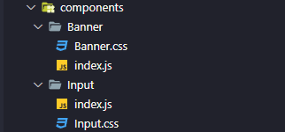
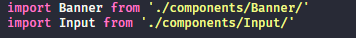
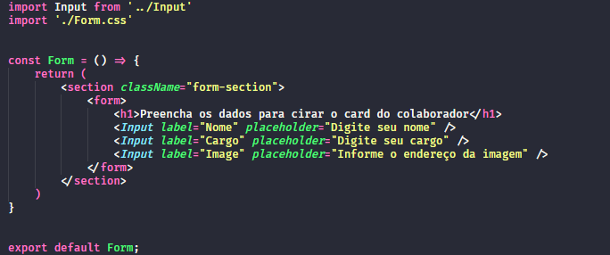

# Organo 1.0.0

To run:

`$ npm run start`

```json
"scripts": {
    "start": "react-scripts start",
    "build": "react-scripts build",
    "test": "react-scripts test",
    "eject": "react-scripts eject"
  }
```


__npm__ (short for Node Package Manager) is a package manager for Node.js packages. It is used to install, manage, and share packages, as well as manage project dependencies. With npm, you can download and install packages globally or locally, update packages, and uninstall packages.

On the other hand, __npx__ is a tool that comes with npm and was introduced in npm version 5.2.0. npx is used to execute packages without installing them globally. It allows you to run a command-line tool that is not installed on your machine, without having to install it first. When you run a command with npx, it checks if the package is installed, and if it isn't, it downloads the package, runs the command, and then deletes the package.

In summary, npm is used to install and manage packages, while npx is used to execute packages without installing them globally.

## __#1 A declarative library__

Create project:

`$ npx create-react-app project_name`


### JSX

JSX (JavaScript XML) is a syntax extension of JavaScript that allows you to write HTML-like code in your JavaScript files. It was introduced by Facebook and is commonly used in React, a popular JavaScript library for building user interfaces.

With JSX, you can write HTML-like code in your JavaScript files, which makes it easier to create and manipulate the UI elements of your application. For example, instead of creating elements using the createElement method, you can write JSX code like this:

`const element = <h1>Hello, world!</h1>;`

Overall, JSX is a powerful tool that allows you to write HTML-like code in your JavaScript files, which makes it easier to create and manipulate the UI elements of your application.


__Banner Component__

Create a folder in ./src called 'components'. In this folder, can be used to create
the components e edit itself;


```jsx
// ./src/components/Banner.js
import './Banner.css';

function Banner() {
  return (
    <header className>
       
      <!-- Image available in ./public/images-->
    </header>
  )
}
```
To use the component in ./src/App.js

```jsx
// ./src/App.js
import './App.css';
import Banner from './components/Banner/Banner'

function App() {
  return (
    <div className="App">
      <Banner /> <!-- Banner component -->
    </div>
  );
}

export default App;

```

### Import with index.js in component 





This way, you need just to import the component folder, and not the file name


## Componet parameters (props)

> " destructuring assignment "

In JavaScript, const { label, placeholder } = props is a destructuring assignment that allows you to extract specific properties from an object and assign them to variables with the same name. This can be useful when you have an object with many properties, but you only need a few of them.

For example, if you have an object called props with the properties label, placeholder, and value, you can use destructuring assignment to extract only the label and placeholder properties like this:

`const { label, placeholder } = props;`

After this assignment, you can use the variables label and placeholder directly in your code, without having to use the props.label or props.placeholder syntax.

On the other hand, using props.label or props.placeholder directly accesses the properties of the props object without extracting them into separate variables. This is useful when you need to access many properties of an object, or when you want to pass the entire object to another function.

In summary, destructuring assignment with `const { label, placeholder } = props` allows you to extract specific properties from an object and assign them to variables with the same name, while using `props.label` or props.placeholder directly accesses the properties of the props object without extracting them.


### __Using props__

```jsx
// ./src/App.js
import Banner from './components/Banner/'
import Input from './components/Input/'

function App() {
  return (
    <div className="App">
      <Banner />
      <Input label="Nome" placeholder="Digite seu nome" /> 
      <Input label="Cargo" placeholder="Digite seu cargo" />
      <Input label="Image" placeholder="Informe o endereço da imagem" />
    </div>
  );
}

export default App;

```

```jsx
// ./src/components/Input/index.js
import './Input.css';

const Input = (props) => {
    const { label, placeholder } = props; //destructuring assignment
    return (
        <div className="input-field">
            <label>
                {label} <!--access value from property label-->
            </label>
            <input placeholder={placeholder}/> <!--access value from property placeholder-->
        </div>
    )

}

export default Input;

```

We can also use components inside another component, like this:




#Summary:
- We created a new React project;
- We created functional components;
- We styled components with CSS;
- We analyzed the project dependencies;
- We analyzed the available commands in the package.json file.

## __#2 Working with props__


About react:

- Created by facebook
- Component Rendering and Communication
- In the beginning the components were class-based
- It reacts to the state of the component's components, wrapping the DOM
- Does not reset with each user interaction
- Each loss of the page can change, separately

## Teams List

The componente select must be contain a list of teams

### `map`

> Map always scrolls through the list e return and tranform in a diferente list

```tsx
// ./src/components/Select/index.js
import './Select.css';

const Select = (props) => {
    const { label } = props;
    return (
        <div>
            <label> 
                {label}
            </label>
            <select>
                {
                    props.item.map(item => {
                        return <option key={item}>{item}</option>
                    })
                    // props.item.map(item => <option>{item}</option>) short version
                }
            </select>
        </div>
    )
}

export default Select;
```

More about map: [forEach ou Map](https://www.alura.com.br/artigos/javascript-quando-devo-usar-foreach-e-map)

### __About key__

> "Keys help React identify which items have changed, are added, or are removed. Keys should be given to the elements inside the array to give the elements a stable identity:"

```tsx
const todoItems = todos.map((todo) =>
  <li key={todo.id}>
    {todo.text}
  </li>
);
```

### __Data bind__

Events:

When a button, inside a form, is clicked,  its default event is submitted the form to page url. To preven the default event, we need to use `preventDefault()` method;

```jsx

// ...
const onSave = (event) => {
  event.preventDefault();
  console.log("Form submission");
}

return (
  <section className="form-section">
    <form onSubmit={onSave}>
      {/* ... */}
    </section>
)

```

> `event`: "The simplest way to create an event is to click somewhere on the page. When you click, a click event is triggered. This event is actually an object containing information about the action that just happened."

> `event.prveventDefaul()` The preventDefault() method cancels the event if it is cancelable, meaning that the default action that belongs to the event will not occur.
>
>For example, this can be useful when:
>- Clicking on a "Submit" button, prevent it from submitting a form
>- Clicking on a link, prevent the link from following the URL
>
>__Note__: Not all events are cancelable. Use the cancelable property to find out if an event is cancelable.
>
>__Note__: The preventDefault() method does not prevent further propagation of an event through the DOM. Use the stopPropagation() method to handle this.


#Summary:

1. How to pass props to a component;
2. How to render lists with `.map()`;
3. How to work with nested elements using the `children` prop;
4. How to listen for events triggered by the DOM, such as the `onSubmit` of our form.

The first thing we learned was how to pass props to a React component. Props are properties that we pass to a React component, allowing us to configure its behavior and content in a flexible way.

Next, we learned how to render lists with the `map()` method. `Map()` is a JavaScript array method that allows us to iterate over a list and generate a new array with the results of each iteration. With `map()`, we can dynamically render lists of elements based on data received via props or stored in the component's state.

Additionally, we learned how to work with nested elements using the `children` prop. The `children` prop is a special prop in React that allows us to pass nested JSX elements as props. This is especially useful when working with layout components and wanting to have the ability to add content inside them.

Finally, we learned how to listen for events triggered by the DOM, such as the `onSubmit` of our form. React allows us to add event listeners directly to our components, allowing us to have greater control over their behavior and interaction with the user.

## __#3 Interacting with User__

> If the component state changes, the component must bu rerender itself

> In React, controlling inputs involves using the value and onChange attributes to control the input value and respond to user changes, respectively. This means that you can create a controlled input by setting its value to a state variable and updating that variable whenever the user types something or makes changes to the input.

```jsx
// ./scr/components/Input
import './Input.css';

const Input = (props) => {
    const { value, label, placeholder, isRequired } = props;

    // 
    const onTyped = (event) => {
        props.onChanged(event.target.value);
    }


    return (
        <div className="input-field">
            <label>
                {label}
            </label>
            <input value={value} onChange={onTyped} required={isRequired} placeholder={placeholder}/>
        </div>
    )

}

export default Input;
```

In this code, ``__value__` is being used to control the value of the input field. It is a prop passed into the component from its parent component and is used to set the value of the input field. This means that the input value will be controlled by the parent component and any changes to it will be reflected in the parent component's state.

__`onTyped`__ is a function that is called whenever the user types something into the input field. It is defined within the component and takes an `__event__` parameter. When called, it extracts the current value of the input field from the  `__event__` object and passes it to the onChanged function, which is another prop passed into the component from its parent component. This allows the parent component to handle the input changes and update its state accordingly. So, onTyped serves as a callback function that triggers a specific behavior in the parent component whenever the user types something in the input field.

### useState()

> `useState` is a React Hook the allows us to add a state to a component. The state is a way to store data in a component and update it whenever necessary.

    "To manage the state of a component in React, you can use the useState hook, which allows you to create and update state variables for your component. When the state is updated, the component re-renders to reflect the updated state."


```jsx
import { useState } from 'react';

function Example() {
  const [count, setCount] = useState(0); // the count is a var/data; the setCount is the setter for the count property

  return (
    <div>
      <p>You clicked {count} times</p>
      <button onClick={() => setCount(count + 1)}>
        Click me
      </button>
    </div>
  );
}
```
"In this example, `__useState(0)__` is used to initialize the `count` state to 0. The `__setCount__` function can be used to update the state of count. When the user clicks the button, the onClick event calls setCount and increments the count by 1.

Note that the `__useState()__` hook can be called multiple times in a single component to manage multiple state variables."


## [?] About spread syntax in JavaScript:

> The spread syntax in JavaScript is represented by three dots (...) and it is used to expand iterable elements such as arrays, objects, and strings into individual elements.

For example, if you have an array `myArray` and you want to create a new array with all the elements of myArray and a few more, you can use the spread syntax like this:


```js
const myArray = [1, 2, 3];
const newArray = [...myArray, 4, 5];
console.log(newArray); // Output: [1, 2, 3, 4, 5]
```

n this example, the spread syntax expands the myArray elements into individual elements and adds the new values 4 and 5 to create a new array newArray.

The spread syntax can also be used to copy arrays and objects, like this:

```js
const myArray = [1, 2, 3];
const newArray = [...myArray];
console.log(newArray); // Output: [1, 2, 3]

const myObject = { name: 'John', age: 30 };
const newObject = { ...myObject };
console.log(newObject); // Output: { name: 'John', age: 30 }

```
"__In these examples, the spread syntax creates a new array and a new object with the same elements and properties as the original ones. This is useful when you want to create a new object or array without modifying the original one.__"

### __#Sumary__

Yes, in the lesson you learned how to control inputs in a form using the `value` and `onChange` attributes, which allow you to control the input value and react to user changes, respectively.

You also learned how to manage the state of a component using the `useState` hook. `useState` allows you to create a state for your component and update it reactively, meaning that every time the state is updated, the component is re-rendered.

Additionally, you learned how to work with props that are functions, meaning props that pass functions as parameters to other components. This is useful when you need to pass a function from a parent component to a child component so that it can update the state of the parent component.


## __#4 Assembling the teams__
## __#5 Bug hunting__


# Organo 1.2.0

To this project stage, We need to add a new feature: The application must be able to create a new team in org. 


## Framework x Library 


### __Library__

A library is a collection of reusable code modules or functions that can be used by 
applications to perform operation specifica tasks. Libraries focus on providing specific 
functionalities or solvindo particular problems. They typically oofer a ser of APIs 
(Application Programming Interfaces) that developers can use to access the library's features.
Unlike frameworks, libraries don't enforce any particular structure or architecture on the
application. Examples of libraries include React, TensorFlow, and jQuery.

### __Framework__

A Framework is a comprehensive set of tools, libraries, and rules that provide a structure for
developing applications. If oftern includes pre-define patters, guidelines, and abstractions that
help developers build applications more efficiently. Frameworks typically have a skelton that 
develpers can extend and customize to build their specific appklcation. Examples of frameworks include
Raby on Rails, Django, and Angular. 


## __Arrow functions__

```js
const arrow_function = () => { console.log () }
arrow_function();
```
Arrow functions are a clear and concise method of writing normal/regular JavaScript
functions in a more accurate  and shorte way. Arrow functions were introduced in the
ES6 version. They make our code more structed and readable.

Arrow functions are anonymous functions without a name and a not bound by a indentifier.
__Arrow functions__ don't return any value and can ben declared without the function
keyword. They are also called __Lambda functions__


